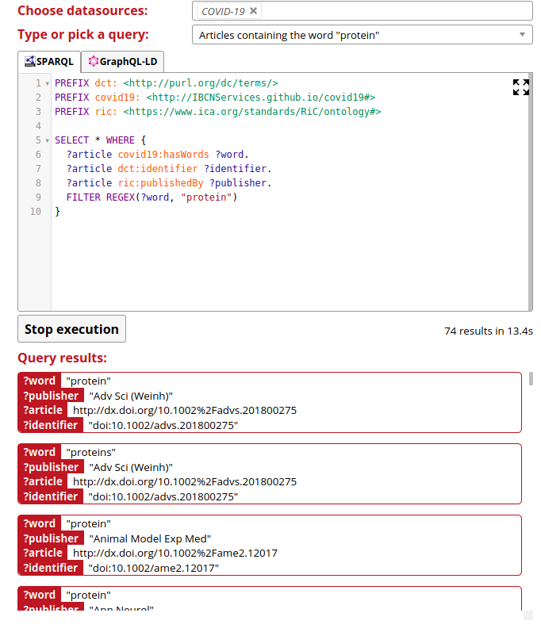

# Generating a Knowledge Graph of COVID-19 Literature

## Preparing the JSONs

### Create a sample dataset
Make sure you have a directory called `sample` with a `papers` directory in there. Then run `python3 scripts/generate_sample_data`.

### Create bag of words of the content
To create a bag of words for title, abstract and body, run `python3 scripts/create_bow.py <INPUT_DIR> <OUTPUT_DIR>`. As an example, you could run: `python3 scripts/create_bow.py sample output`.

### Mapping the string representations to known resources
Run `python3 scripts/map_entities.py <INPUT_DIR> <OUTPUT_DIR>` to generate different pickled dictionaries with the following structure: `{string: URI}`.

## Running RML

## Linked Data Fragments endpoint

We are hosting an endpoint that can be used for querying [here](https://query-covid19.linkeddatafragments.org/). The corresponding repository for this can be found [here](https://github.com/rubensworks/covid19-web-query-client).

## Knowledge Graph Applications

# Acknowledgements

This has been a collaboration between a lot of people:
* [Bram Steenwinckel](https://bsteenwi.github.io/)
* [Pieter Heyvaert](https://pieterheyvaert.com/)
* Michael Weyns
* Anastasia Dimou
* [Pieter Colpaert](https://pietercolpaert.be/)
* [Ruben Taelman](https://www.rubensworks.net/)
* Ruben Dedecker
* [Dylan Van Assche](https://www.dylanvanassche.be/)
* Femke Ongenae

